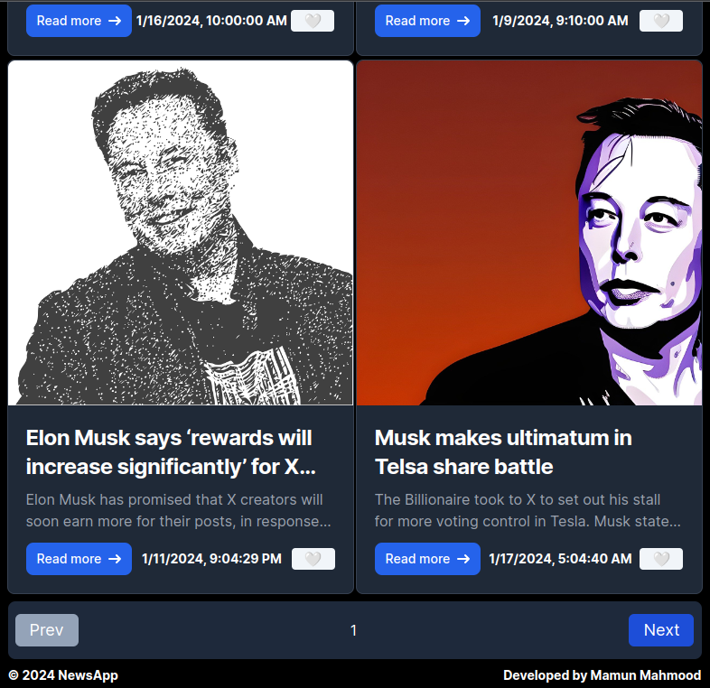

# News APP

A PWA news app that uses the News API to fetch news articles with offline support.

## SCREENSHOTS

## Table of Contents

- [Installation](#installation)
- [Usage](#usage)
- [Contributing](#contributing)
- [License](#license)

## Installation

1. Clone the repository
2. Run `npm install` to install the dependencies
3. .env file is required with the following variables:
    -NEXT_PUBLIC_NEWS_API_KEY=
    -NEXT_PUBLIC_apiKey=
    -NEXT_PUBLIC_authDomain=
    -NEXT_PUBLIC_projectId=
    -NEXT_PUBLIC_storageBucket=
    -NEXT_PUBLIC_appId=
4. Run `npm run dev` to start the development server

## Usage

The API may not work if it crosses the limit of requests. You can use your own API key to fetch the news articles. Add NEXT_PUBLIC_NEWS_API_KEY in the .env file.

The offline will work on production build. Check the live site [here](https://newsapp-gules.vercel.app/)

## Contributing

Guidelines for contributing to the project, including information on how to submit pull requests or report issues.

## License

Information about the project's license and any relevant terms or conditions.
